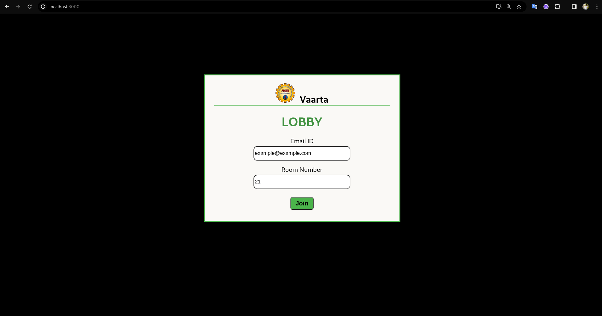
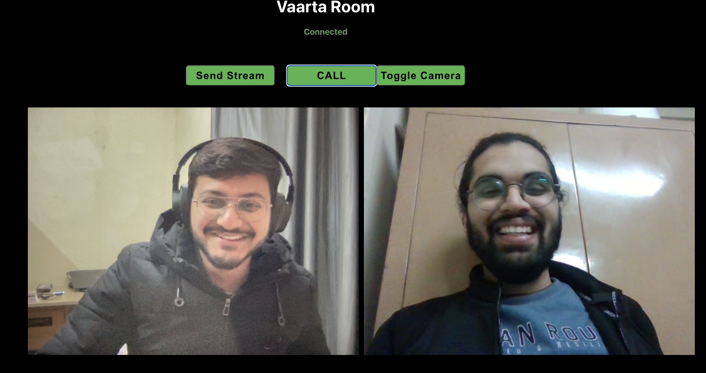
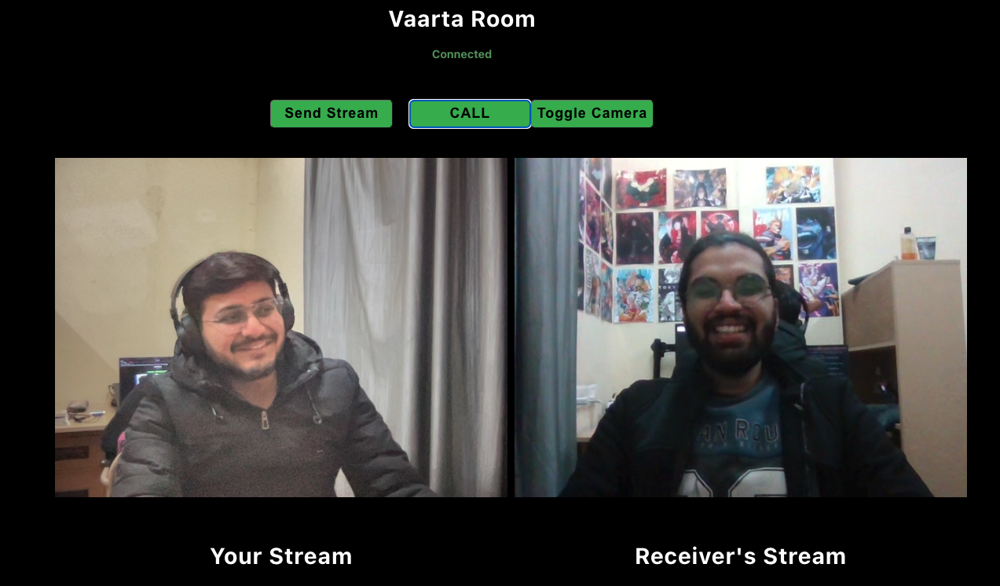

# Vaarta
A personalized online meeting platform

### Technology used

- Backend - Node.js
- Frontend - React.js
- Framework - webRTC

**Setting up on a Local Machine**
1. Clone the repository.
2. Start the server: `cd server && docker-compose up -d`
3. Start the client: `cd client && docker-compose up -d`
4. Visit `localhost:3000` in your web browser to access the application.

## Screenshots
  
  
  